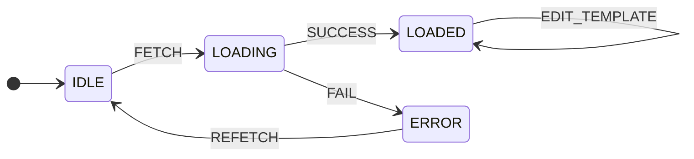
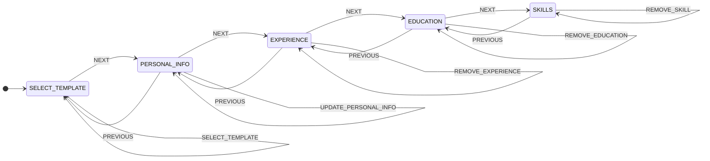

## Templates State Machine

---

| States  |
| ------- |
| IDLE    |
| LOADING |
| LOADED  |
| ERROR   |

| Actions         |
| --------------- |
| ADD_TEMPLATE    |
| DELETE_TEMPLATE |
| EDIT_TEMPLATE   |
| FETCH           |
| REFETCH         |
| SUCCESS         |
| FAIL            |

| Internal data | Notes                                                                  |
| ------------- | ---------------------------------------------------------------------- |
| data          | The data returned by a successful call, containing templates           |
| template      | The template to be added, edited or deleted from the list of templates |

## Resume Editor State Machine

---

| States          |
| --------------- |
| SELECT_TEMPLATE |
| PERSONAL_INFO   |
| EXPERIENCE      |
| EDUCATION       |
| SKILLS          |

| Actions              |
| -------------------- |
| NEXT                 |
| PREVIOUS             |
| SELECT_TEMPLATE      |
| UPDATE_PERSONAL_INFO |
| ADD_EXPERIENCE       |
| UPDATE_EXPERIENCE    |
| REMOVE_EXPERIENCE    |
| ADD_EDUCATION        |
| UPDATE_EDUCATION     |
| REMOVE_EDUCATION     |
| ADD_SKILL            |
| UPDATE_SKILL         |
| REMOVE_SKILL         |

| Internal data      | Notes                                                      |
| ------------------ | ---------------------------------------------------------- |
| selectedTemplateId | The currently selected resume template id                  |
| personalInfo       | Personal information of the candidate                      |
| experiences        | List of work experiences                                   |
| education          | List of educational qualifications                         |
| skills             | List of skills with their respective scores                |
| state              | The current state of the resume editor (one of the States) |
