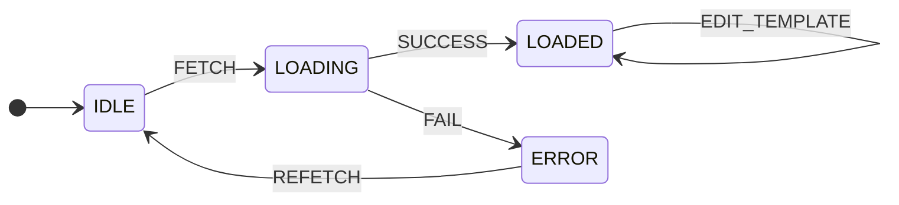

## Templates State Machine

---

| States  |
| ------- |
| IDLE    |
| LOADING |
| LOADED  |
| ERROR   |

| Actions         |
| --------------- |
| ADD_TEMPLATE    |
| DELETE_TEMPLATE |
| EDIT_TEMPLATE   |
| FETCH           |
| REFETCH         |
| SUCCESS         |
| FAIL            |

| Internal data | Notes                                                                  |
| ------------- | ---------------------------------------------------------------------- |
| data          | The data returned by a successful call, containing templates           |
| template      | The template to be added, edited or deleted from the list of templates |
